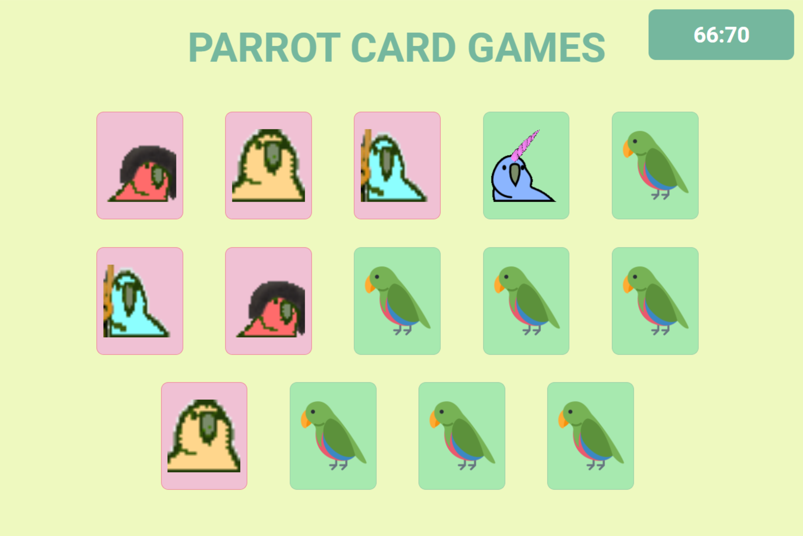

# <p align = "center">Web Mobile DrivenEats</p>

<p align = "center"></p>

## ✏️ Description
<p align="justify" >This project was done in the fourth week of the Full Stack Driven course. An average of 30 hours were put into the website, the main goals were to train javascript logic, using only js vanilla. I also learned about regex while developing the game.</p>

##  <p align = "left"> :white_circle: Technologies</p>

- [JavaScript](https://www.javascript.com/)
- [HTML5](https://html5.org/)
- [CSS3](https://www.w3.org/Style/CSS/)

# 🏁 Let's go!

First clone this github repository into your computer, then open the folder cloned:

```bash
https://github.com/ecocaval/Projeto_04_parrotsCardGame.git
```
Open the index.html file in your default browser and enjoy the website!
